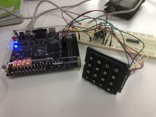

# Digital-Systems-VHDL

# 4 digits calculator based on logic gates 

 
-----------------

This project consisted on designing a 4 decimal digit calculator with logic circuits(logic gates, flip-flops, multiplexers, encoders, decoders etc.). The four principal operations are addition, substraction division and multiplication. The whole project was built using Quartus.  

    
    
Final project report written in spanish:

https://github.com/Alfzzz/Digital-Systems-VHDL/blob/master/final.pdf
